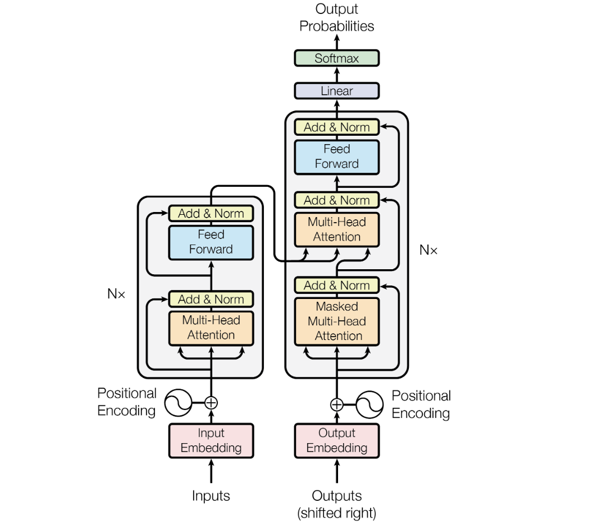
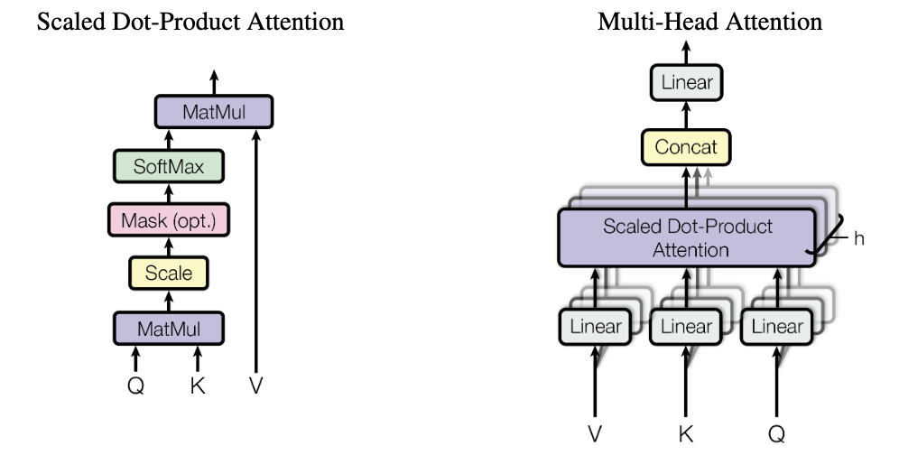
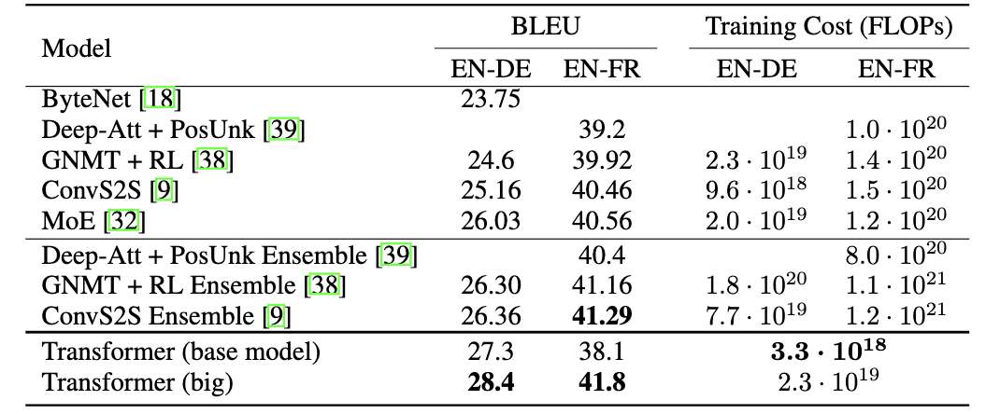
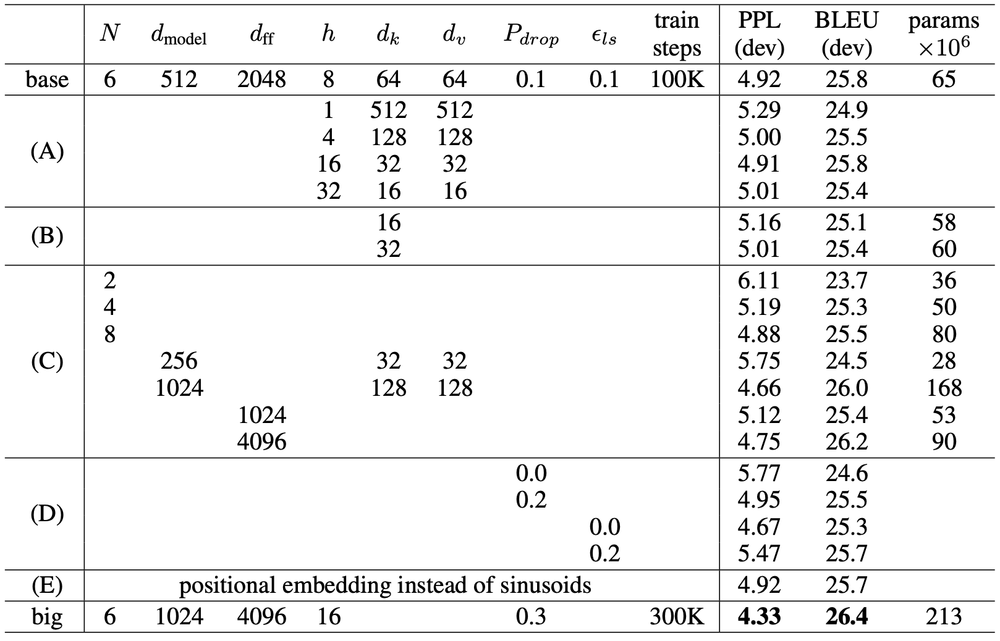
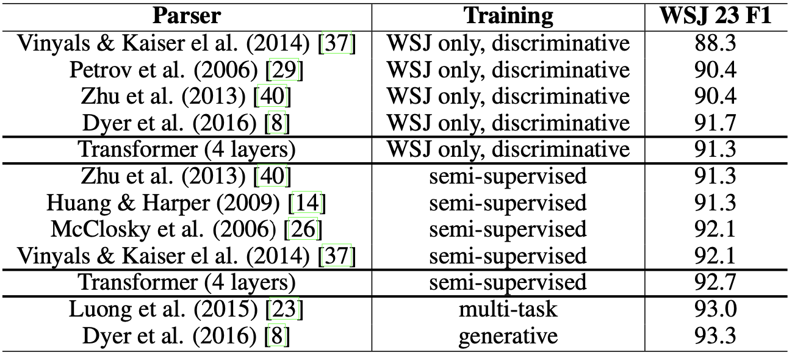

# Attention is all you need (zh-tw)

## Abstract

目前主流的序列推倒模型是基於有著 Encoder（編碼器）、Decoder（解碼器）的 CNN / RNN 模型，表現最好的模型也使用注意力機制來連結 Encoder（編碼器）、Decoder（解碼器）。
我們推出了一個新的簡單網路架構：『Transformer（變壓器）』，整個架構完全基於 Attention Mechanism （注意力機制），屏棄了遞歸以及卷積。
在兩個機器翻譯的實驗中，這些模型展示了他們更加優異的品質，同時有著更多的並行性且顯而易見更少的時間訓練。
我們的模型在 2014 WMT 英語翻譯德語的任務中取得 28.4 BLEU ，比現有的最佳模型及組裝型的模型還高出了 2 個 BLEU 。
在 WMT 2014 英語翻譯法語的任務中，我們的模型在 8 個 GPU 上經過 3.5 天的訓練後取得了 41.9 BLEU ，創下了單一模型的新紀錄，而這僅僅是我們最佳文學模型的訓練成本中的一小部分。
我們展示了 Transformer 在其他任務中優良的泛化能力，並且成功應用於英文句子解析，無論是在大型的訓練資料集下或是有限的訓練資料集。

## 1. Introduction

RNN、LSTM、Gated Recurrent 神經網路，在處理序列建模、轉換問題（例如：語言建模、機器翻譯）已經被認為是最先進的方法。許多人致力於推動 Encoder-Decoder 架構的發展。

遞歸模型（Recurrent Model）通常根據輸入和輸出序列的符號位置進行計算分解。
它們將位置對齊到計算時間的步驟中，生成一系列隱藏狀態 $h_t$，作為前一隱藏狀態 $h_{t-1}$ 和位置 $t$ 的輸入的函數。
這種本質上的序列性質阻礙了訓練範例內的並行處理，這在較長的序列長度時變得至關重要，因為記憶體限制限制了跨範例的批次處理。
最近的工作通過分解技巧和條件計算在計算效率上取得了顯著改進，同時在後者的情況下也改善了模型性能。然而，序列計算的基本限制仍然存在。

注意力機制已成為各種任務中引人注目的序列建模和轉換模型的一個不可或缺的部分，使模型能夠建立依賴關係而不考慮它們在輸入或輸出序列中的距離。
然而，在少數情況外，這種注意力機制通常與遞歸網絡一起使用。

在這項發表中，我們提出了 Transformer 模型架構，此架構放棄了遞歸，而完全依賴注意力機制來捕捉輸入和輸出之間的全局依賴關係。
Transformer 允許更多的並行處理，並且在八個 P100 GPU 上訓練僅十二小時後，可以達到翻譯最先進的水準。

## 2. Background

降低序列計算的目標也是擴展神經 GPU、ByteNet 和 ConvS2S 的基礎，這些模型都使用卷積神經網絡（CNN）作為基本建構塊，並且為所有輸入和輸出位置並行計算隱藏表示。
在這些模型中，將來自兩個任意輸入或輸出位置的信號關聯所需的操作數量隨位置之間的距離增長，對於 ConvS2S 是線性的，對於 ByteNet 是對數的。
這使得學習遠距離位置之間的依賴性更加困難。
在變壓器中，這被減少到常數操作數量，儘管因為平均注意力加權位置而降低了有效解析度，我們在第 3.2 節中描述的多頭注意力可以抵消這一效應。

自注意力（有時稱為內部注意力）是一種注意力機制，它關聯單一序列的不同位置，以便計算序列的表示。自注意力已成功應用於多種任務，包括閱讀理解、抽象摘要、文本蘊含和學習任務獨立的句子表徵。

端到端記憶網絡基於一種遞歸的注意力機制，而不是序列對齊的遞歸，已被證明在簡單語言問答和語言建模任務上表現良好。

據我們所知，變壓器是第一個轉換模型，完全依賴自注意力來計算其輸入和輸出的表徵，而不使用序列對齊的 RNN 或卷積。在接下來的章節中，我們將描述變壓器模型，闡述自注意力的動機，並討論其相對於其他模型（如文獻中的[17, 18]和[9]）的優勢。

> [!NOTE]
> 文獻 17: Łukasz Kaiser and Ilya Sutskever. Neural GPUs learn algorithms. In International Conference on Learning Representations (ICLR), 2016.  
> 文獻 18: Nal Kalchbrenner, Lasse Espeholt, Karen Simonyan, Aaron van den Oord, Alex Graves, and Koray Kavukcuoglu. Neural machine translation in linear time. arXiv preprint arXiv:1610.10099v2, 2017.  
> 文獻 9: Jonas Gehring, Michael Auli, David Grangier, Denis Yarats, and Yann N. Dauphin. Convolutional sequence to sequence learning. arXiv preprint arXiv:1705.03122v2, 2017.

## 3. Model Architecture

大多數具有競爭力的神經序列轉換模型都具有編碼器-解碼器結構。
在這裡，編碼器將符號表示的輸入序列 $(x_1,...,x_n)$ 映射到連續表示的序列 $z = (z_1, ..., z_n)$ 。給定 $z$，解碼器接著一次生成一個元素的符號輸出序列 $(y_1,...,y_m)$ 。
在每一步中，模型是自回歸的，生成下一個符號時會將先前生成的符號作為額外的輸入。

**圖片1: The Transformer - 模型架構**

變壓器模型遵循這種總體架構，使用堆疊的自注意力和逐點的全連接層來構建編碼器和解碼器，分別顯示在圖1的左半部和右半部。

### 3.1 編碼器與解碼器的堆疊

**編碼器：**  
編碼器是由 $N = 6$ 個層所組成，而每一層有兩個子層。第一層是多頭注意力機制，第二層是簡單的全連接 FFN。
我們用殘差連接每兩個子層，接著使用層正規化。而每個子層會通過 LayerNorm(x + Sublayer(x))，其中 Sublayer(x) 是在子層本身實作的。
為了加快殘差連接，在模型裡的所有子層、嵌入層都以維度 $d_{model} = 512$ 作為輸出。

> [!NOTE]
> FFN: postition-wise Feed-Forward Network  
> Residual Connection: 殘差連接

**解碼器：**  
解碼器也是由 $N = 6$ 個層所組成，除了每個編碼層的兩個子層，解碼器插入了第三個子層，此層對編碼器堆疊的輸出進行多頭注意力機制。
和編碼器很像，我們用層正規化來對每個子層作殘差連接。我們還修改了解碼器堆疊的自注意力子層來避免當前資料位置使用到後面的位置。
這種 mask 結合了輸出嵌入偏移一個位置的本質，確保對位置 $i$ 的預測只依賴於小於 $i$ 的已知輸出。

> [!NOTE]
> prevent positions from attending to subsequent positions 確保模型訓練時專注於需要的位置

### 3.2 Attention

注意力函數可以當作將查詢（Query）和一組鍵值對應到輸出，其中查詢、鍵、值和輸出都是向量。
而輸出是用值的加權和去計算，其中每個值的權重是通過查詢與相應鍵的相容性函數所計算的。

**圖片2: （左）縮放內積注意力（右）多頭注意力由多個注意力層平行運算所組成**

> [!NOTE]
> Feed-Forward Network：前饋網絡

#### 3.2.1 Scaled Dot-Product Attention

我們將我們的特定注意力稱為「縮放內積注意力」（圖 2）。輸入包含維度 $d_k$ 的查詢和鍵，維度為 $d_v$ 的值。
我們計算查詢與所有鍵的內積，將每個點積除以 $\sqrt{d_k}$，並使用 softmax 函數來取得值上的權重。
實作上，我們同時用一組查詢計算注意力函數，將這些查詢被打包成矩陣 $Q$。鍵和值也同時被打包成矩陣 $K$ 和 $V$。

我們計算輸出矩陣如下：

$$
\text{Attention}(Q, K, V) = \text{softmax}\left(\frac{QK^T}{\sqrt{d_k}}\right)V
$$

兩種最常用的注意力函數是加法和內積（乘法）注意力。點積注意力與我們的演算法相同，除了縮放因子 $\frac{1}{\sqrt{d_k}}$。
加法注意力使用一個具有單一隱藏層的前饋網路（Feed-Forward Network）來計算相容性函數。雖然這兩者在理論複雜性上差不多，內積注意力在實作中更快且更省空間，因為它可以利用高度優化的矩陣乘法程式實作。

在 $d_k$ 的值下，這兩種機制的表現相似，對於較大的 $d_k$ ，加法注意力優於沒有縮放的內積注意力。
我們猜想對於較大的 $d_k$ ，內積的成長規模會變大，使得讓 softmax 函數推向具有極小梯度的區域。為了抵消這種效果，我們將內積縮放 $\frac{1}{\sqrt{d_k}}$ 倍。

#### 3.2.2 多頭注意力

除了利用 $d_{\text{model}}$ 維度的鍵、查詢、值來執行單注意力函式。我們發現它分別對於線性投影到有不同已學習的 $d_k$、 $d_k$ 和 $d_v$ 維度有更好的效果。
對於這些投影版本的查詢、鍵和值，我們平行執行注意力函數，得到了 $d_v$ 維度的輸出值。這些輸出值被串聯起來，再次投影產生最終值，如圖 2 所示。

多頭注意力使模型連帶地得到來自不同位置之不同子空間表示的信息。使用單一的注意力頭時，平均化會抑制這一點。

$$
\text{MultiHead}(Q, K, V) = \text{Concat}(\text{head}_1, ..., \text{head}_h)W^O
$$

其中 $\text{head}_i = \text{Attention}(QW_i^Q, KW_i^K, VW_i^V)$

其中投影矩陣為參數矩陣 $W_i^Q \in \mathbb{R}^{d_{\text{model}} \times d_k}$、 $W_i^K \in \mathbb{R}^{d_{\text{model}} \times d_k}$、 $W_i^V \in \mathbb{R}^{d_{\text{model}} \times d_v}$ 和 $W^O \in \mathbb{R}^{hd_v \times d_{\text{model}}}$。

在這項工作中，我們使用了 $h = 8$ 個平行的注意力層（頭）。對於每個頭，我們使用 $d_k = d_v = d_{\text{model}} / h = 64$。
由於每個頭的維度減小，總計算成本和全維度的單頭注意力差不多。

#### 3.2.3 我們模型裡的注意力應用

變壓器用三個不同方法使用多頭注意力

- 在「編碼器-解碼器注意力」層中，查詢是來自上一個解碼器層，而記憶鍵和值來自編碼器的輸出。這使得解碼器中的每個位置得到輸入句子中的所有位置。這模仿了句子到句子模型中典型的編碼器-解碼器注意力機制，如 [38, 2, 9]。
- 編碼器包含自注意力層。在自注意力層內的所有的鍵、值和查詢都來自同一個地方，在這種情況下是來自編碼器中上一層的輸出。編碼器的每個位置可以得到上一層的編碼器的所有位置。
- 同樣地，解碼器裡的自注意力層使解碼器中的各個位置得到解碼器中到該位置為止的所有位置。我們需要去預防解碼器中的信息左頃以維持自動回歸的特性。我們在縮放點積注意力內部實現這一點，利用掩蔽（設定為 $-\infty$） 輸入至 softmax 中對應於非法連接的所有值。見圖 2。

### 3.3 Position-wise 前饋網路

除了注意力子層，在我們編碼器、解碼器層的裡頭都有全連接前饋網路，這個網路分別且相同地應用於每個位置。
它包含量個線性轉換，其中有 Relu 激活函數。

$$
\text{FFN}(x) = \max(0, xW_1 + b_1)W_2 + b_2
$$

雖然線性轉換在不同的位置是相同的，不同之間使用的是不同參數。另一種解釋方式是這是一個有著 kernel 大小為 1 的兩個卷積。
輸入、輸出的維度大小為 $d_{model} = 512$，而內層的維度是 $d_{ff} = 2048$。

### 3.4 嵌入層以及 Softmax 函數

和其他序列轉換模型相似，我們使用已學習的嵌入來轉換輸入 tokens 和輸出 tokens 到維度 $d_{model}$ 的向量。
我們還使用了一般的已學習線性變換和 softmax 函數來將解碼器的輸出轉換成預測下一個 tokens 的機率。
在我們的模型中，我們在兩個嵌入層和 pre-softmax 線性變換之間使用相同的權重矩陣，類似於 [30]。在嵌入層中，我們將這些權重乘以 $\sqrt{d_{\text{model}}}$。

| 層類型           | 每層複雜度               | 順序操作 | 最大路徑長度   |
| ---------------- | ------------------------ | -------- | -------------- |
| 自注意力         | $O(n^2 \cdot d)$         | $O(1)$   | $O(1)$         |
| 循環層           | $O(n \cdot d^2)$         | $O(n)$   | $O(n)$         |
| 卷積層           | $O(k \cdot n \cdot d^2)$ | $O(1)$   | $O(\log_k(n))$ |
| 自注意力（受限） | $O(r \cdot n \cdot d)$   | $O(1)$   | $O(n/r)$       |

**表 1：不同層類型的最大路徑長度、每層之複雜度和最小序列操作數。n 是序列長度，d 是表示維度，k 是卷積的核大小，r 是受限自注意力中鄰域的大小。**

### 3.5 位置編碼

因為我們的模型不包含循環、卷積，為了使模型記住句子的順序，我們得在句子中的標記中使用一些關於相對、絕對位置的資訊。
為此，我們在編碼器、解碼器堆疊的底部的輸入嵌入層加上「位置編碼」。
位置編碼和嵌入有相同的維度 $d_{model}$，因此兩者可以相加。
有很多可以選擇的位置信息編碼，在參考 [9]可以看到。

這項工作，我們用了不同頻率的正弦、餘弦函數：

$$
PE_{\text{(pos},2i)} = \sin\left(\frac{\text{pos}}{10000^{\frac{2i}{d_{\text{model}}}}}\right)
$$

$$
PE_{\text{(pos},2i+1)} = \cos\left(\frac{\text{pos}}{10000^{\frac{2i+1}{d_{\text{model}}}}}\right)
$$

其中 ${pos}$ 是位置，$i$ 是維度。也就是說，位置編碼的每個維度對應於一個正弦曲線。
波長形成一個從 $2\pi$ 到 $10000$ $\cdot2\pi$ 的幾何級數。我們選擇這個函數是因為我們假設它可以讓模型輕鬆學習相對位置進行關注，因為對於任何固定偏移量 $k$，
$PE_{\text{pos}+k}$可以表示為 $PE_{\text{pos}}$ 的線性函數。

我們還嘗試使用已學習的位置嵌入 [9]，發現這兩個版本產生了幾乎相同的結果（見表 3，E 行）。
我們選擇了正弦曲線版本，因為它可以讓模型推論更長的句子，比起訓練期間遇到的句子更長。

## 4. Why Self-Attention

在本節中，我們將比較自注意力層與常用於將一個可變長度符號表示序列 $(x_1, ..., x_n)$ 映射到另一個等長序列 $(z_1, ..., z_n)$ 的循環層和卷積層。
這些符號表示的每個元素 $x_i, z_i \in \mathbb{R}^d$，例如典型序列轉導編碼器或解碼器中的隱藏層。促使我們使用自注意力的原因有三個考慮。

首先是每層的總計算複雜度。其次是可以並行化的計算量，通過所需的最小序列操作數量來衡量。

第三個是網路中長程依賴的路徑長度。學習長距離依賴是許多序列轉換任務中的一個關鍵挑戰。
影響學習這些依賴性的一個重要因素是信號在網路中正向和反向傳播的路徑長度。
輸入和輸出序列中任何位置之間的這些路徑越短，就越容易學習長程依賴。因此，我們還比較了由不同層類型組成的網絡中任意兩個輸入和輸出位置之間的最大路徑長度。

如表 1 所示，自注意力層以固定數量的順序執行操作連接所有位置，而循環層需要 $O(n)$ 時間操作。
在計算複雜度方面，當序列長度 $n$ 小於表示維度 $d$ 時，自注意力層比循環層更快。
這在機器翻譯中使用的句子表示中經常出現，例如字節片段（ word-piece ）和字節對（ byte-pair ）表示 [31]。
為了改善涉及長序列任務的計算性能，自注意力可以限制為僅考慮輸入序列中圍繞各自輸出位置的大小為 $r$ 的鄰域。
這將最大路徑長度增加到 $O(n/r)$。我們計劃在未來的工作中進一步研究這種方法。

以單的卷基層而言，如果寬度 $k < n$ 則不能連接所有輸入和輸出位置對。
在連續核的情況下，這樣做需要堆疊 $O(n/k)$ 個卷積層，或者在膨脹卷積的情況下為 $O(\log_k(n))$，增加了網絡中任兩個位置之間的最長路徑長。
卷積層通常比循環層的成本高出 k 倍。然ㄓㄦ，可分離卷積明顯降低了複雜度，到 $O(k \cdot n \cdot d + n \cdot d^2)$。
即使在 $k = n$ 的情況下，可分離卷積的複雜性也相當於一個自注意力層和一個點對點前向層的組合，這是我們在我們模型中采用的方法。

作為附加好處，自注意力機制可以產生更具可解釋性的模型。我們檢查了我們模型中的注意力分布，並在附錄中展示和討論了一些例子。
不僅個別的注意力頭明顯已學會了執行不同的任務，許多還表現出與句子的語法和語義結構相關的行為。

## 5. Training

這節介紹我們模型的訓練規範

### 5.1 訓練資料、批次處理（Training data and Batching）

我們在標準 WMT 2014 英轉德的訓練資料上訓練，總共有 450 萬個句子。
這些句子使用 BPE 編碼，其有來源轉換目標的字彙表，大約有 37000 個 tokens 。

> [!NOTE]
> 其有共享的單字字彙表（來源轉目標），內含 37000 個單字可以對應轉換過來的 tokens 。

對於英文、法語，我們用更大型的 WMT 2014 英轉法資料集，總共有 3600 萬個句子，我們將它們分割進去一個大小為 32000 word-piece 的單字表。  
其中相似長度的句子們綁在同一批次。而每次批次訓練包含大約 25000 個來源 tokens 以及 25000 個目標 tokens。

> [!NOTE]
> word-piece: 用 BPE 把字拆成一片片

### 5.2 使用硬體、排程（Hardware and schedule）

我們在 8 NVIDIA P100 GPU 的機器上訓練。我們的基礎模型使用論文提及的超參數，每個訓練步數花 0.4 秒。
我們總共用了 10 萬個步數共 12 小時來訓練我們的基礎模型。對於我們的大模型（在下方 table 3 所提及的），每個步數花了 1 秒。
而這個大模型使用了 30 萬步數來訓練，共花了 3.5 天。

### 5.3 優化器（Optimizer）

我們使用 Adam 優化器，其參數為 $\beta_1 = 0.9$， $\beta_2 = 0.98$， $\epsilon = 10 ^ {-9}$，我們根據以下的公式調整訓練的學習率：

$$
lrate = d_{model}^{-0.5} \cdot \min(step\_num^{-0.5}, step\_num \cdot warmup_steps^{-1.5})
$$

這是根據第一個訓練步驟 $warmup\_steps$ 來線性地增加學習率，之後依照步驟數的平方根倒數等比例降低，而我們使用 $warmup\_steps = 4000$。

### 5.4 正規化（Regulation）

我們在訓練中採用三種不同類型的正規化：

**表 2：Transformer 在英轉德、英轉法的 newstest2014 測試中，比之前的 SOTA 模型得到了更高的 BLEU 分數，且只需要一些訓練成本。**

**Residual Dropout** 在 transformer 加到子層的輸入和正規化之前，我們在每個子層的輸出加上 dropout。
此外，我們在編碼器、解碼器的堆疊中的嵌入層、位置編碼層的總和加上 dropout。
對於基礎模型，我們使用的 dropout rate 為 $P_{drop} = 0.1$。

**Label Smoothing** 在訓練期間，我們使用 Label Smoothing ，其值為 $\epsilon_{ls} = 0.1$。
這會提高準確率和 BLEU 分數，但會對困惑度造成影響，使模型變得比較不確定。

## 6. Results

### 6.1 Machine Translation

在 WMT 2014 的英翻德任務中，大型變壓器模型（表 2 中的 Transformer（big））的表現超越了之前報告的最佳模型（包括模型集合），超過 2.0 BLEU 分，創下了新的最先進 BLEU 分數 28.4。
這個模型的配置列在表 3 的底部。訓練在 8 塊 P100 GPU 上進行，耗時 3.5 天。即使是我們的基本模型也超越了所有之前發布的模型和集合，且訓練成本只是競爭模型的一小部分。

在 WMT 2014 的英翻法任務中，我們的大型模型達到了 41.0 的 BLEU 分數，超越了所有之前發布的單一模型，並且訓練成本不到之前最先進模型的 1/4。
用於英翻法的變壓器（大型）模型採用了 0.1 的丟失率 Pdrop，而不是 0.3。

對於基本模型，我們使用了通過平均最後5個檢查點獲得的單一模型，這些檢查點每10分鐘寫入一次。對於大型模型，我們平均了最後20個檢查點。我們使用束搜索（beam search），束大小為4，並使用長度懲罰因子 α = 0.6。這些超參數是在開發集上進行實驗後選擇的。我們將推理期間的最大輸出長度設定為輸入長度+50，但在可能的情況下提前終止。

表2總結了我們的結果，並將我們的翻譯質量和訓練成本與文獻中其他模型架構進行了比較。我們通過將訓練時間、使用的 GPU 數量以及對每個 GPU 維持的單精度浮點運算能力的估計相乘，來估算訓練一個模型所使用的浮點運算次數。

### 6.2 Model Variations

為了評估變壓器不同組件的重要性，我們以不同方式變化了我們的基礎模型，測量了在開發集（newstest2013）上進行英往德翻譯的性能變化。我們使用了前一節中描述的束搜索，但沒有進行檢查點平均化。我們在表3中展示了這些結果。

**表 3：變壓器架構的變化。未列出的值與基礎模型相同。所有指標均基於英往德翻譯開發集newstest2013。列出的困惑度是每個字節對編碼的字節片計算的，不應與每個單詞的困惑度相比較。**

在表3的行(A)中，我們改變了注意力頭的數量以及注意力鍵和值的維度，如第3.2.2節所述，同時保持計算量恆定。雖然單頭注意力比最佳設置低0.9 BLEU分，但注意力頭過多時，質量也會下降。

在表3的行(B)中，我們觀察到減少注意力鍵的大小 \(d_k\) 會損害模型的質量。這表明確定兼容性並非易事，可能需要比點積更複雜的兼容性函數來提升效果。我們在行(C)和(D)中進一步觀察到，正如預期的那樣，更大的模型表現更好，並且使用丟失率(dropout)在避免過擬合方面非常有幫助。在行(E)中，我們用學習的位置嵌入取代了我們的正弦位置編碼，觀察到的結果與基礎模型幾乎相同。

### 6.3 English Constituency Parsing

為了評估變壓器是否可以推廣到其他任務，我們對英語句法結構分析進行了實驗。這項任務提出了特定的挑戰：輸出受到強烈的結構約束，且顯著長於輸入。此外，遞歸神經網絡（RNN）序列到序列模型在小數據環境下未能達到最先進的結果。

我們在賓夕法尼亞樹庫的華爾街日報（WSJ）部分訓練了一個4層的變壓器，模型維度為1024，約40K訓練句子。我們還在半監督環境中進行了訓練，使用了約1700萬句子的更大的高信心和伯克利解析器語料庫。對於僅WSJ的設置，我們使用了16K個詞彙的詞彙表，對於半監督設置，我們使用了32K個詞彙的詞彙表。

我們在第 22 部分開發集上僅進行了少量實驗來選擇丟失率（包括注意力和殘差的），學習速率和束大小，所有其他參數保持與英德基礎翻譯模型相同。在推理期間，我們將最大輸出長度增加到輸入長度 + 300。對於僅WSJ和半監督設置，我們使用了束大小為21，α為0.3。

**表 4：變壓器模型在英語句法結構分析上具有良好的泛化能力（結果來自WSJ的第23節）。**

我們在表4中的結果顯示，儘管缺乏針對特定任務的調整，我們的模型表現出色，比之前報導的所有模型都有更好的結果，唯一的例外是遞歸神經網絡語法（Recurrent Neural Network Grammar）[8]。

與遞歸神經網絡（RNN）序列到序列模型[37]相比，即使僅在華爾街日報（WSJ）的40K句子訓練集上訓練，變壓器模型也超過了伯克利解析器（Berkeley-Parser）[29]。

## 7. Conclusion

在這次的工作中，我們展示了 Transformer ，這是第一個完全基於注意力機制的序列轉換模型，利用了編碼器、解碼器架構與多頭自注意力機制以取代最常見的循環層。
對於翻譯任務， Transformer 訓練起來比利用卷積層、循環層訓練的模型快上許多。
在 WMT 2014 英轉德以及 WMT 2014 英轉法的翻譯任務中，我們達到了新水平。
在前一個任務，我們最好的模型甚至贏過所有之前紀錄過的組合模型。
我們對未來基於注意力的模型的應用感到興奮，也計畫要將模型應用於其他任務上。
我們計畫要將 Transformer 拿去解決除了文本以外，不同形式的輸入、輸出。
並研討局部、受限的注意力機制，以高效地處理大型輸入和輸出，如圖片、影音。
而讓生成的過程減少順序性是我們另一個研究目標。
